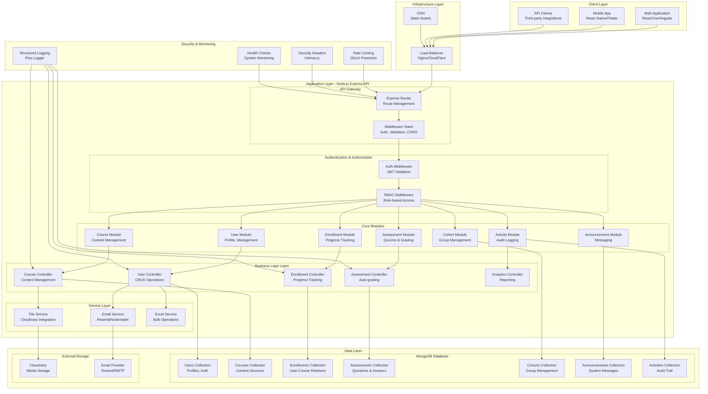
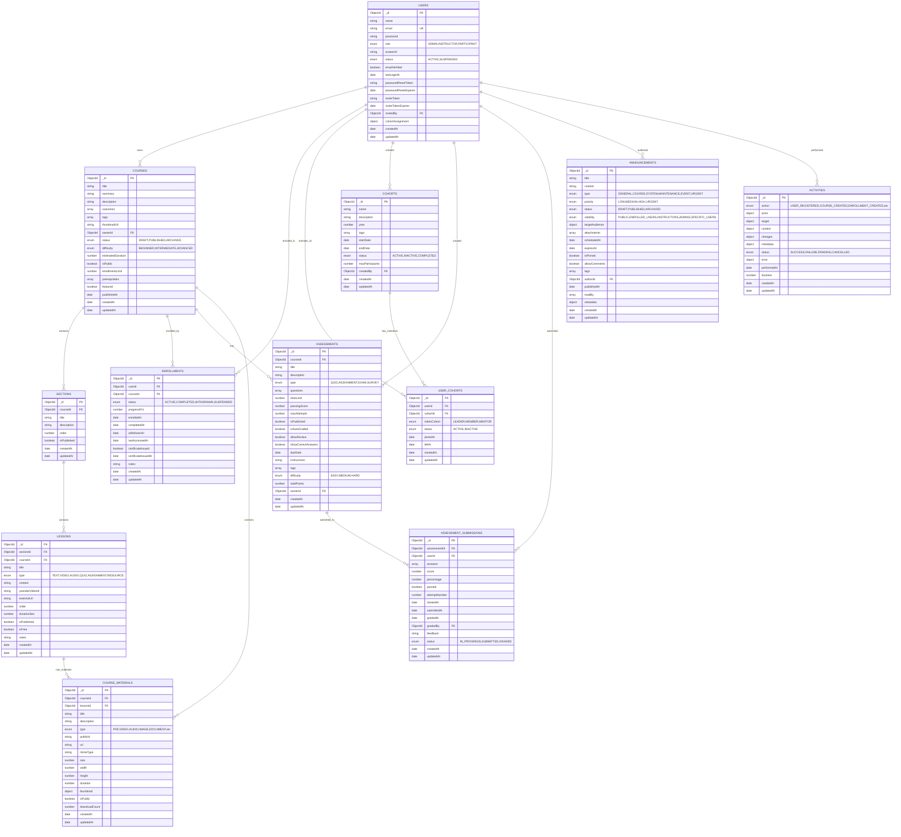
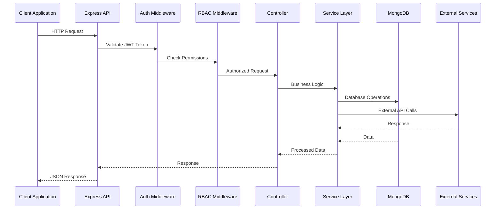
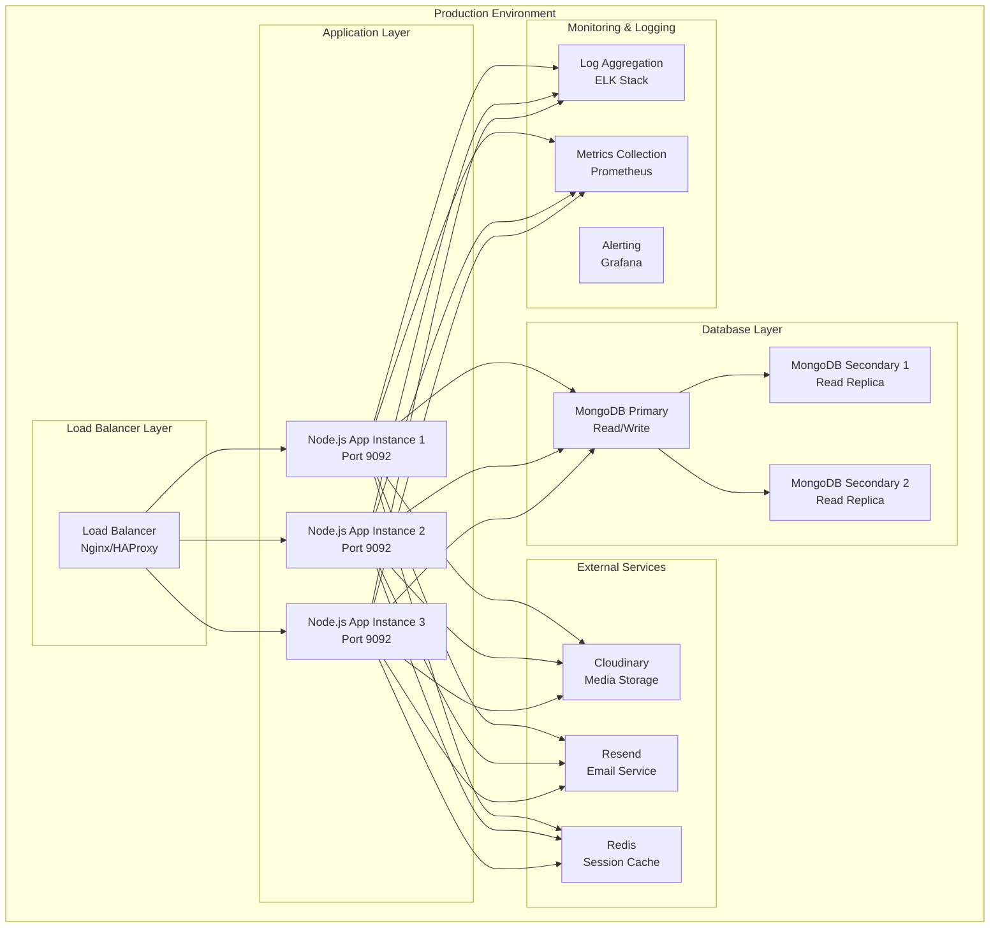

# CONFAB Purpose Discovery LMS - Architecture Diagrams

## 🏗️ System Architecture Diagram

## 🗄️ Database Schema Diagram

## 🔄 Data Flow Diagram

## 🏗️ Deployment Architecture

## 📊 System Components Overview

### **Frontend Layer**

- **Web Application**: React/Vue/Angular SPA
- **Mobile Application**: React Native/Flutter
- **API Clients**: Third-party integrations

### **API Gateway Layer**

- **Express Router**: Route management and middleware
- **Authentication**: JWT token validation
- **Authorization**: Role-based access control
- **Rate Limiting**: DDoS protection
- **CORS**: Cross-origin resource sharing

### **Business Logic Layer**

- **User Management**: Profile, authentication, bulk operations
- **Course Management**: Content creation, sections, lessons
- **Enrollment System**: Progress tracking, completion
- **Assessment System**: Quizzes, auto-grading, submissions
- **Cohort Management**: Group-based learning
- **Analytics**: Reporting and insights

### **Data Layer**

- **MongoDB**: Primary database with collections for all entities
- **Cloudinary**: Media storage and processing
- **External APIs**: Email services, file storage

### **Security & Monitoring**

- **Structured Logging**: Pino logger with context
- **Activity Tracking**: Comprehensive audit trail
- **Health Checks**: System monitoring
- **Error Handling**: Centralized error processing
